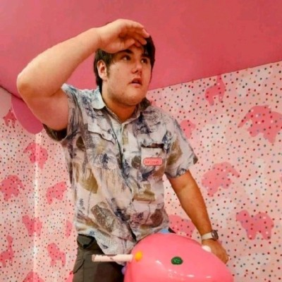

# Welcome to Robert's GitHub Page!

## Nice To Meet You!

My name's Robert Luiten, I'm a student studying computer science at the University of Washington! Nice to meet you!

## Coursework

I've been a part of several courses at the University of Washington. Here are some of my favorites:

- **Software Documentation!**
- ***Natural Language Processing***
- ***Machine Learning***
- ***Deep Learning***
- ***Automated Robotics***
- ***Game Design For Interactive Preformance***

Here's some of my favorite restraunts in Seattle:

| Name    | Type |
|---------|------|
| Sultans | Mediterranean |
| Aladins | Mediterranean |
| UDON Noodles | Ramen |

## More About Me!

You can learn about me [here](https://robertluiten.github.io/about.html)!

***This webpage was created as part of my coursework for Software Documentation at the University of Washington!***
